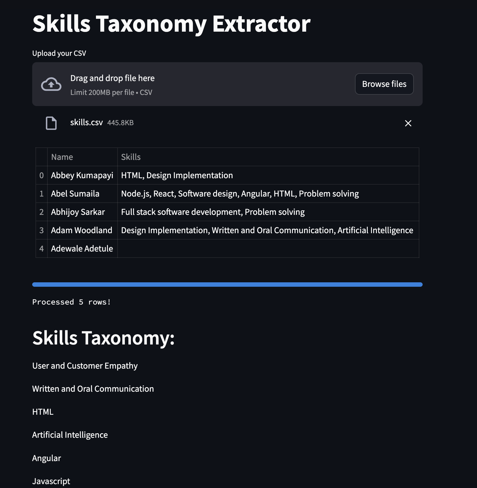

# Skills Extractor

This codebase helps to extract skills of people from a CSV files and create tags of those skills. These tags are then used to create a skill taxonomy and assign these tags from this taxonomy to the emoployees mentioned in the CSV file.

## Explanation of the files

1. [cluster_skills.py](cluster_skills.py) - Consists of the parallelized clusterization algorithm to make the skill taxonomy broader. Low `n_clusters` means more generalization and vice versa to be more specific.
2. [utils.py](utils.py) - Main file that consists the logic to generate [skills_taxonomy.txt](skills_taxonomy.txt) and [individual_skills.csv](individual_skills.csv).
3. [app.py](app.py)
4. [individual_skills.csv](individual_skills.csv) - A dataframe consists of 2 columns `Name` and `Skills` for every employee.
5. [skills_taxonomy.txt](skills_taxonomy.txt) - List of Skills that were generated from the initial dataset after clusterization.
6. [postprocessing.py](postprocessing.py) - In case you need a more refined output, i.e., make the skill taxonomy more broader or more specific. It generates [individual_skills_refined.csv](individual_skills_refined.csv) and [skills_taxonomy_refined.txt](outputs/skills_taxonomy_refined.txt)
7. [individual_skills_refined.csv](individual_skills_refined.csv) - It has the same format as [individual_skills.csv](individual_skills.csv) after running [postprocessing.py](postprocessing.py).
8. [skills_taxonomy_refined.txt](outputs/skills_taxonomy_refined.txt) - It has the same format as [skills_taxonomy.txt](skills_taxonomy.txt) after running [postprocessing.py](postprocessing.py).
9. [logs.txt](logs.txt) - Consists of the logs of an example run of [utils.py](utils.py)

## Instructions to run
1. Create a `CSV` that has a column called "Skill Sets" that consists of skills defined in natural language for employees.
2. Create a `.env` file and define `OPENAI_API_KEY` environment variable. (Number of API calls will be equal to the number of rows in your CSV.)
3. `python3 -m venv venv`
4. `pip install -r requirements.txt`
5. Run `python3 utils.py > logs.txt 2>&1`
6. To get a more refined output run `python3 postprocessing.py --n_clusters 100`

## Streamlit application link
The application is deployed in this link: **[Skill Extractor UI](https://skill-extractor.streamlit.app/)**

